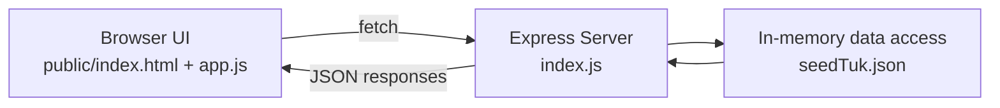

# Web API Development Project

A lightweight, data-driven REST API built with Express, plus a browser dashboard to explore and test endpoints in real time.

## Project Snapshot

- Project type: Node.js + Express REST API
- Data source: local JSON file (`seedTuk.json`)
- Runtime: CommonJS, Express 5
- Default port: `3000` (or `PORT` env value)
- Includes: API routes and a frontend API explorer

## Why This Project Exists

This project demonstrates core Web API development fundamentals:

- Designing clean resource-based routes
- Returning structured JSON responses
- Handling missing resources with `404` responses
- Serving a static frontend that consumes backend endpoints
- Keeping architecture simple and easy to learn

## Architecture Overview



### Request Lifecycle

1. Client requests an endpoint.
2. Express route handler selects data from `seedTuk.json`.
3. Data is transformed to response shape.
4. Server returns JSON (`200`) or an error (`404`).

## Project Structure

```text
Web-API-Develepment/
|-- package.json
|-- README.md
|-- WEB API/
|   |-- Web-API/
|   |   |-- index.js                # Express app and routes
|   |   |-- seedTuk.json            # Source dataset
|   |   |-- package.json
|   |   |-- public/
|   |   |   |-- index.html          # API explorer UI
|   |   |   |-- app.js              # Frontend logic (fetch + controls)
|   |   |   |-- styles.css          # Dashboard styling
|   |   |-- README.md
```

## API Endpoints

### System

| Method | Route | Description |
|---|---|---|
| GET | `/` | Opens the API Explorer dashboard |
| GET | `/api` | Returns service status |

### Provinces

| Method | Route | Description |
|---|---|---|
| GET | `/provinces` | List all provinces |
| GET | `/provinces/:provinceId` | Get one province by ID |

### Districts

| Method | Route | Description |
|---|---|---|
| GET | `/districts` | List all districts |
| GET | `/districts/:districtId` | Get one district by ID |

### Stations

| Method | Route | Description |
|---|---|---|
| GET | `/stations` | List all stations |
| GET | `/stations/:stationId` | Get one station by ID |

### Vehicles

| Method | Route | Description |
|---|---|---|
| GET | `/vehicles` | List all vehicles |
| GET | `/vehicles/:vehicleId` | Vehicle details + `last_ping` |
| GET | `/vehicles/:vehicleId/pings` | All pings for one vehicle |
| GET | `/vehicles/:vehicleId/last-position` | Most recent location |

## Example Response Shapes

```json
{
	"province_id": 1,
	"name": "Western"
}
```

```json
{
	"vehicle_id": 12,
	"reg_number": "WP-ABC-1234",
	"device_id": "DVC-12",
	"station_id": 7,
	"last_ping": {
		"ping_id": 888,
		"vehicle_id": 12,
		"timestamp": "2026-05-01T10:30:00.000Z",
		"lat": 6.9271,
		"lng": 79.8612,
		"speed": 0
	}
}
```

## Quick Start

### Option 1: Run from workspace root

```bash
npm install
npm start
```

### Option 2: Run from app folder

```bash
cd "WEB API/Web-API"
npm install
npm start
```

Open:

- Dashboard: `http://localhost:3000/`
- API status: `http://localhost:3000/api`

## GitHub Pages Deployment Note

GitHub Pages can host only static files. It cannot run the Node.js/Express server in `WEB API/Web-API/index.js`.

To make your site usable on GitHub Pages, this repository now includes a static root app:

- `index.html`
- `app.js`
- `styles.css`

This static app emulates your API routes in the browser using `WEB API/Web-API/seedTuk.json` and mirrors the backend response shapes.

## Testing the API Quickly

Use a browser, Postman, or curl:

```bash
curl http://localhost:3000/provinces
curl http://localhost:3000/vehicles/1
curl http://localhost:3000/vehicles/1/last-position
```

## Error Handling Behavior

- Unknown IDs return `404` with `{ "error": "... not found" }`
- Missing pings for a vehicle last-position route returns `404`
- Vehicle details route returns `last_ping: null` when no ping exists

## Technology Stack

- Node.js
- Express 5
- Vanilla HTML/CSS/JavaScript
- JSON dataset as seed data

## Notes

- Data is read from local JSON and served in-memory.
- This project is ideal for API learning, demos, and route practice.
- You can later extend it with database persistence and CRUD operations.
